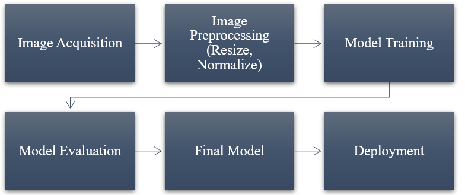
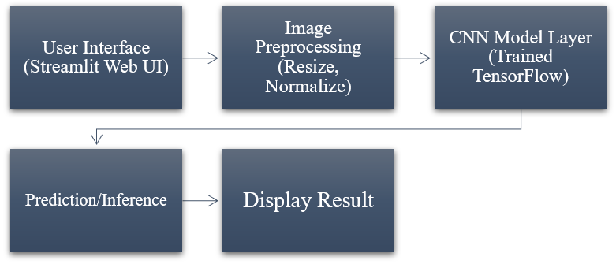

WHEAT DISEASE DETECTION SYSTEM.

An AI-powered image classification system that uses deep learning to identify wheat plant diseases from leaf images.

OVERVIEW.

The Wheat Disease Detection System is a deep learning-based application designed to assist farmers and agricultural personnel in identifying wheat plant diseases from leaf images.
The system allows a user to upload an image of a wheat leaf, processes the image, and uses a trained Convolutional Neural Network (CNN) to predict the corresponding disease class.
The project was developed with a focus on the challenges of early wheat disease identification, where manual inspection can be time-consuming and dependent on agricultural expertise.
The trained model is integrated into a Streamlit web application, providing a simple interface for image upload and prediction.

PROBLEM STATEMENT

Wheat diseases can significantly affect crop health and yield when they are not detected early.
Traditional disease identification often relies on visual inspection by farmers or agricultural experts. This approach can be:

1. Time-consuming
2. Subjective
3. Dependent on expert knowledge
4. Difficult to scale across large farming areas

This project explores how computer vision and deep learning can be used to provide an accessible first-level disease identification tool using photographs of wheat leaves.

KEY FEATURES

1. Image-based disease classification
2. CNN-powered prediction
3. Upload wheat leaf images directly through the web interface
4. Automated image preprocessing
5. Multi-class disease prediction
6. Prediction confidence score
7. Streamlit-based web interface
8. Trained TensorFlow/Keras model
9. Separate notebooks for model training and testing

HOW IT WORKS.

The system follows a simple machine learning pipeline:

PREDICTION OVERFLOW.

1. The user uploads a wheat leaf image.
2. The application reads the image.
3. The image is resized to 128 × 128 pixels.
4. Pixel values are preprocessed for model inference.
5. The trained CNN processes the image.
6. The model generates probabilities for the available disease classes.
7. The class with the highest probability is selected.
8. The application displays the predicted disease and confidence score.

MACHINE LEARNING.

The project uses a Convolutional Neural Network (CNN) for image classification.
CNNs are particularly suitable for image-based tasks because they can learn visual patterns such as:

1. Leaf textures
2. Spots
3. Color Changes
4. Lesions
5. Rust Patterns etc.

DATASET.

The model was trained using the Wheat Plant Diseases Dataset, containing approximately 14,155 images across multiple disease and healthy classes.
The dataset was divided into training, validation, and testing data for model development and evaluation.

MODEL PERFORMANCE.

The model was evaluated using a separate validation set during development.
Current reported results include;

1. Validation Accuracy=81%
2. Input Resolution=128 × 128
3. Number of Classes=15

The project also includes evaluation and training artifacts that can be used to further analyze model performance.

Note: Performance on real-world field images may differ from validation performance because factors such as lighting, camera quality, leaf orientation, background clutter, and disease severity can affect predictions.

APPLICATION PREVIEW.

The Streamlit application provides a simple interface where users can upload a wheat leaf image and receive a model prediction.

TECHNOLOGY STACK.

PROGRAMMING LANGUAGE: Python.

MACHINE LEARNING: TensorFlow, Keras, NumPy.

COMPUTER VISION / IMAGE PROCESSING: OpenCV, PIL.

DATA SCIENCE: Matplotlib, Seaborn, Jupyter Notebook.

APPLICATION: Streamlit.

DEVELOPMENT: VS Code, Git, GitHub.

INSTALLATION

1. Clone the repository:
   
   git clone https://github.com/SadiiqA3/PLANT_DISEASE_DETECTION.git

2. Navigate into the project:
   
   cd PLANT_DISEASE_DETECTION

3. Create a virtual environment:
   
   python -m venv venv

4. Activate the environment:

   Windows:
   venv\Scripts\activate  

   macOS / Linux:
   source venv/bin/activate

5. Install dependencies:

   pip install -r requirements.txt
  
RUN THE APPLICATON.

Start the Streamlit application with:
streamlit run main.py

MODEL DEVELOPMENT.

The repository contains two main Jupyter notebooks:

A.Train_Plant_Disease.ipynb

Used for:

1. Dataset preparation
2. Image Preprocessing
3. Model Creation
4. Model Training
5. Training Evaluation
6. Saving the Trained Model

B. Test_Plant_Disease.ipynb

Used for:

1. Loading the trained model.
2. Testing Predictions.
3. Evaluating Classification Performance
4. Generating Prediction Results

LIMITATIONS.

Although the system can provide useful predictions, it should be considered a decision-support tool rather than a replacement for professional agricultural diagnosis.

Possible limitations include:

1. Model performance may decrease on images significantly different from the training dataset.
2. Poor lighting can affect predictions.
3. Blurry images may produce unreliable results.
4. Multiple diseases appearing on the same leaf may be difficult to classify.
5. Field conditions may differ from controlled dataset conditions.

FUTURE IMPROVEMENTS.

Future versions of the system could include:

1. Native Android/iOS deployment.
2. Integration with location-based agricultural information.
3. Weather and environmental data integration.
4. Disease treatment recommendations.
5. Multilingual support for farmers.
6. Real-time camera-based detection.
7. Transfer Learning using architectures such Efficient or ResNet.
8. Improved performance using larger and more diverse field datasets.

DISCLAIMER:
For Educational and Research Purposes Only

This project is developed for educational, research, and demonstration purposes. 
The predictions generated by the system should not be considered a complete substitute for professional agricultural diagnosis.

Model performance may vary depending on image quality, lighting conditions, disease severity, and differences between real-world images and the training dataset. 
Users should consult a qualified agricultural professional before making crop-management or treatment decisions based solely on the system's predictions.

FOR EDUCATIONAL USE

This project is intended for educational, research, and portfolio demonstration purposes.
